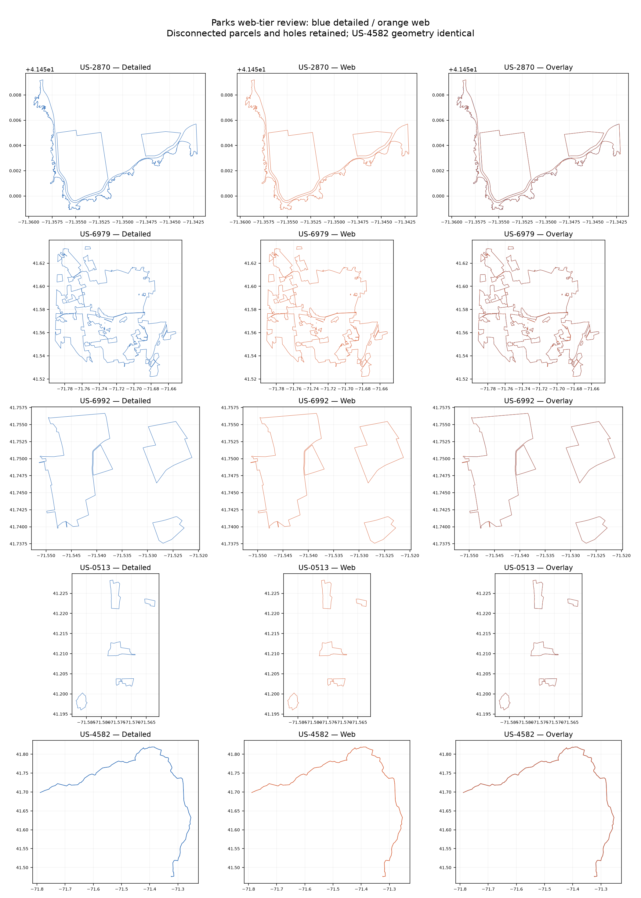
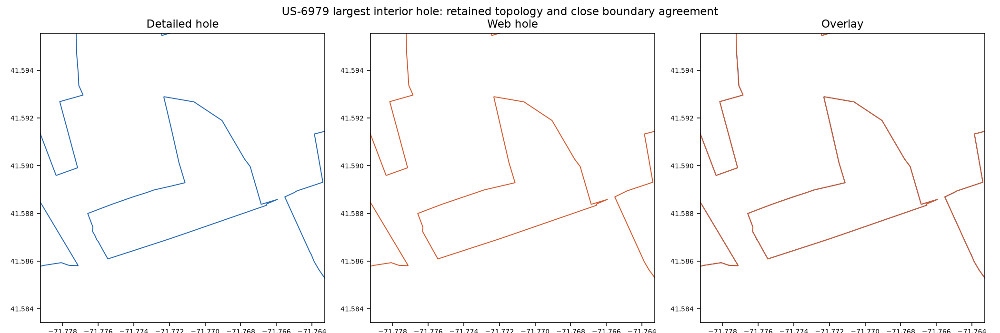

# Web geometry review — 2026-09-05

Reviewed the detailed/web/overlay panels below before release. US-2870 retains
its coastal outline; US-6979 retains separated parcels and internal holes;
US-6992 retains all three disconnected parcels; US-0513 retains separate coastal
components. The US-4582 overlays coincide: the buffered activation-zone geometry
is an identity operation. The enlarged US-6979 hole remains open with close
boundary agreement. No visible gap bridging or lost interior rings was observed.
These are coordinate plots of the checked-in artifacts, not access or legal maps.

| Artifact  | Detailed gzip bytes | Web gzip bytes | Reduction |
| --------- | ------------------: | -------------: | --------: |
| Aggregate |             728,254 |        239,496 |     67.1% |
| US-2870   |             187,960 |          9,706 |     94.8% |
| US-6979   |              42,389 |         26,439 |     37.6% |
| US-6992   |               4,629 |          2,208 |     52.3% |
| US-0513   |               6,578 |          2,504 |     61.9% |
| US-4582   |              15,318 |         15,403 |     -0.6% |

All 50 holes and each reference's component count survive. Maximum absolute
relative area delta is 0.4384%. Generation leaves every detailed/source artifact
byte-identical to the preceding implementation commit, including all `data/`.
The earlier display-API commit adds bounding boxes to package display files but
leaves all coordinates and reviewed data unchanged. Input/output file SHA-256
values and full measurements are generated by `mise run package`, validated by
`mise run check`, and published in the web derivation/measurement artifacts.
